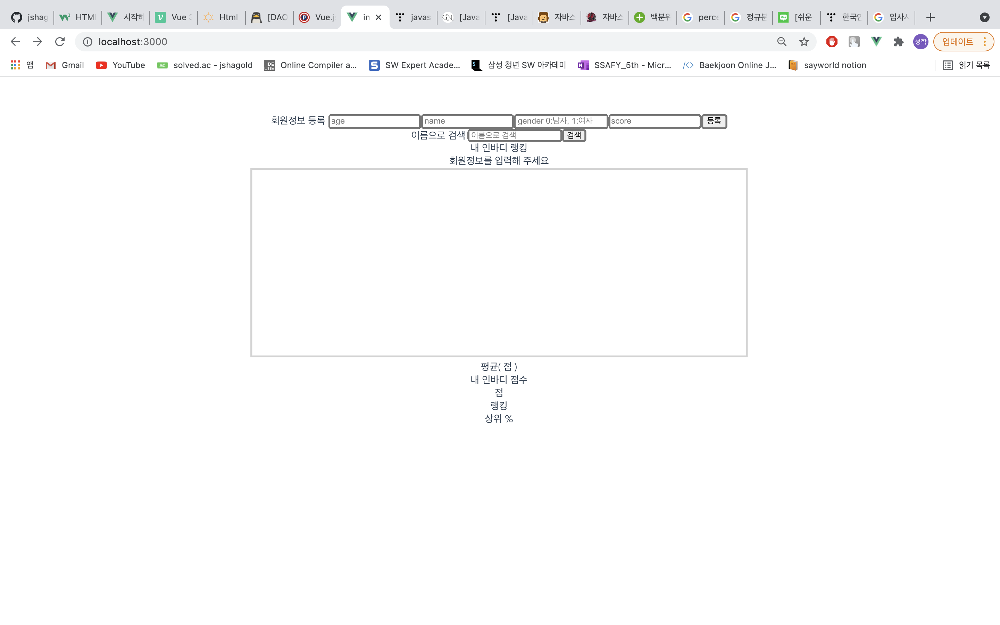
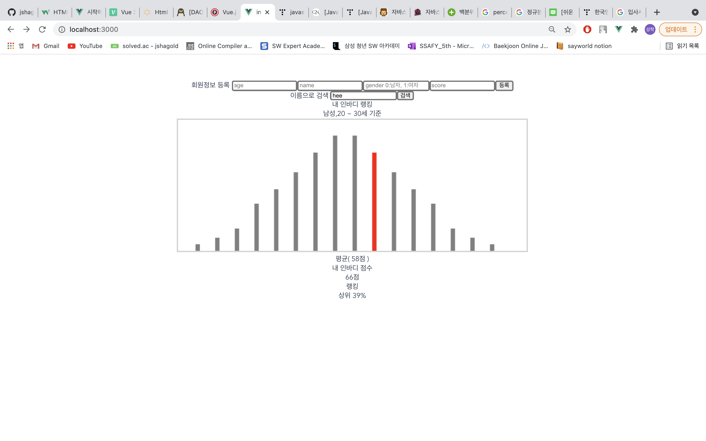
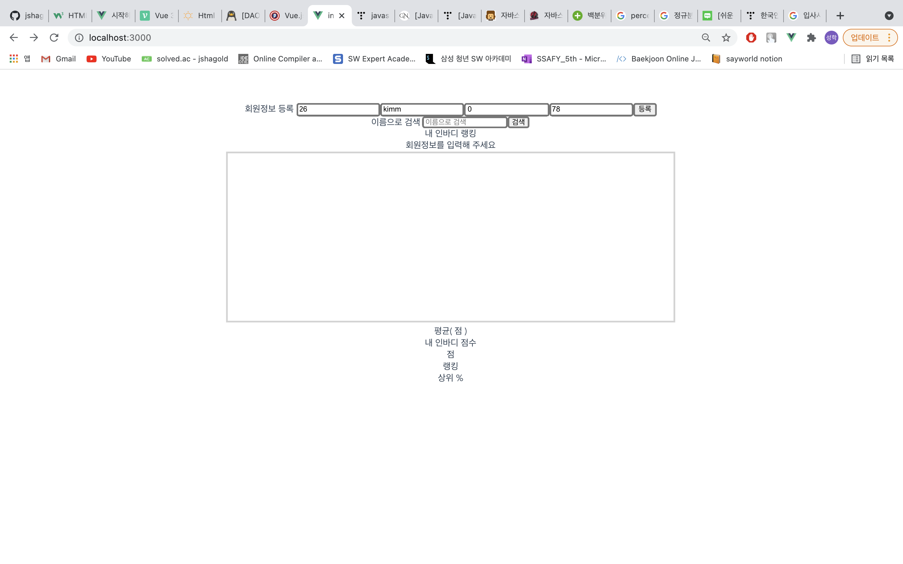
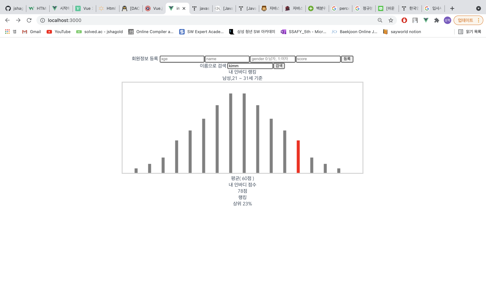
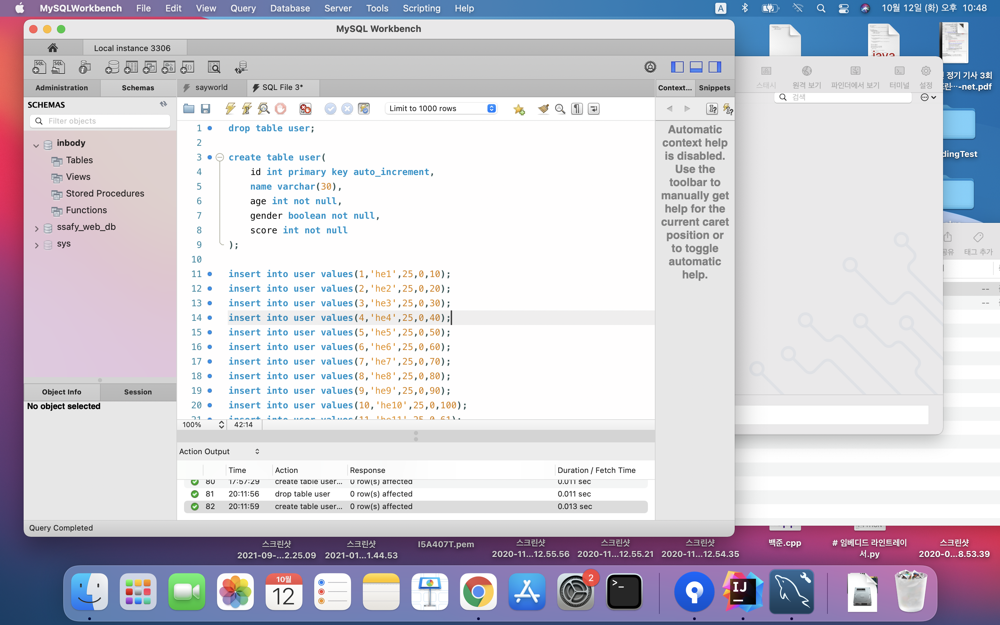

> **InBody 과제 1**

>**화면 구성**

화면 구성은 다음과 같습니다. 

나이, 이름, 성별(0:남자,1:여자), 인바디점수를 입력해서 사용자를 등록하고, 이름을 입력해서 등록된 사용자의 정보를 검색할 수 있습니다.

데이터 베이스에 저장 되어있는 사용자의 이름을 입력하면 해당 사용자의 정보를 볼 수 있습니다.

사용자의 정보를 입력해서 사용자를 등록 할 수 있고,

등록된 사용자의 정보가 잘 나오는 것을 확인할 수 있습니다.

MYSQL에 저장된 테이블의 형태는 다음과 같습니다.

>**프로젝트 구조**

프로젝트는 inbody_back폴더에서 백엔드를, inbody_front폴더에서 프론트엔드 개발을 진행했습니다.
프로젝트는 localhost에서 실행되며 프론트는 3000, 백엔드는 8080 포트를 이용했습니다.

프론트엔드: inbody_front/src/components/ 의 InputData.vue에서 회원등록 기능을 작성했고 InbodyChart.vue에서 차트와 정보를 표시했습니다.
백엔드: inbody_back/src/main/java/com/test/inbody/api/ 의 controller, db, dto, service, 폴더에 각각 컨트롤러와 JPAentity, repository, dto, 서비스 파일을 작성했습니다.
